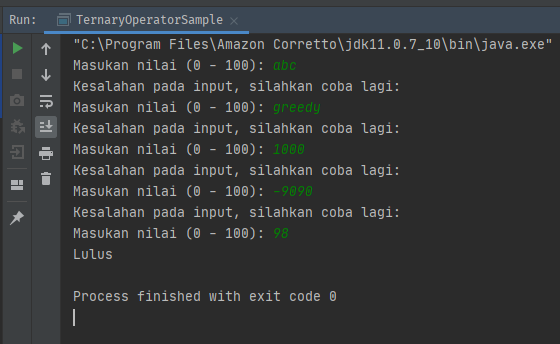

# Ternary Operator

##### Introduction to programming
##### SESSION 5 - Selection (OL) #2

```java
package binus.ol.ac.id;

import java.util.Scanner;

public class TernaryOperatorSample {
    public static void main(String[] args) {


        Scanner input = new Scanner(System.in);

        while (true) {

            System.out.print("Masukan nilai (0 - 100): ");
            try {
                int nilai = input.nextInt();

                if (nilai >= 0 && nilai <= 100) {
                    System.out.println(nilai > 75 ? "Lulus" : "Gagal");
                    break;
                }

                System.out.println("Kesalahan pada input, silahkan coba lagi: ");

            } catch (Exception e) {
                System.out.println("Kesalahan pada input, silahkan coba lagi: ");
                input = new Scanner(System.in);
            }
        }
    }
}

```
*Sample-1*  
